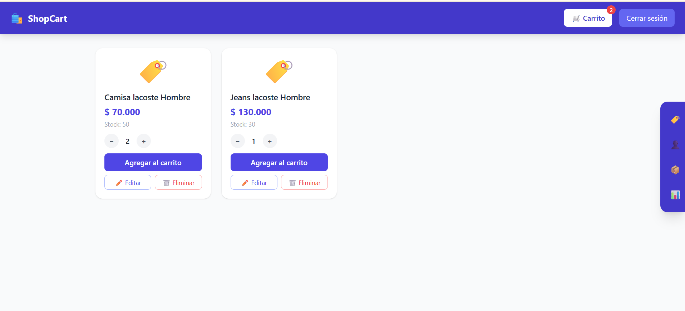
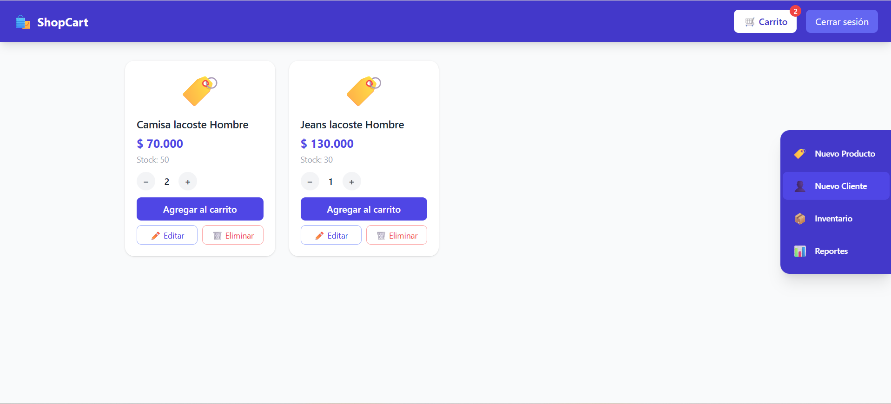
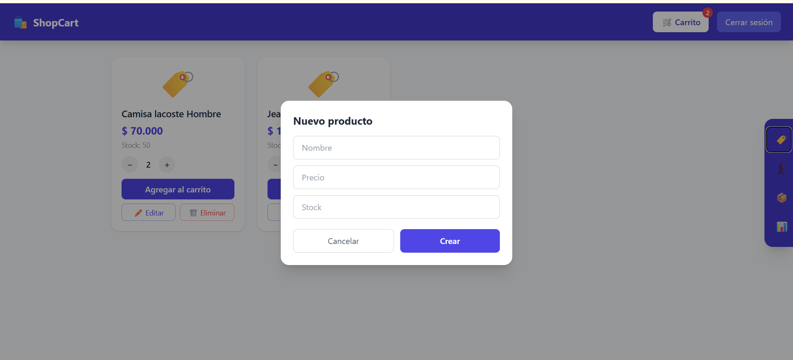
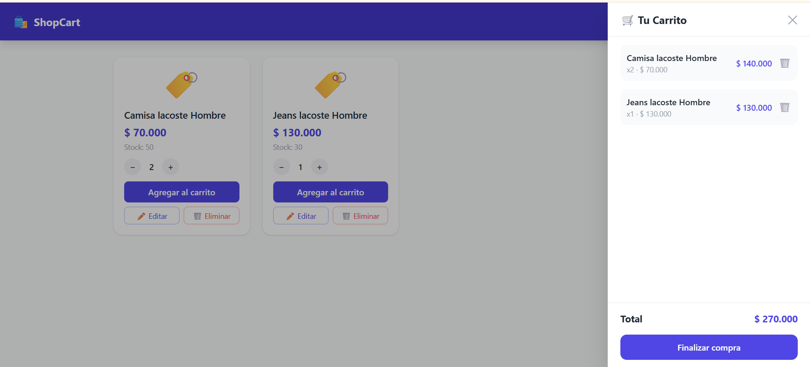
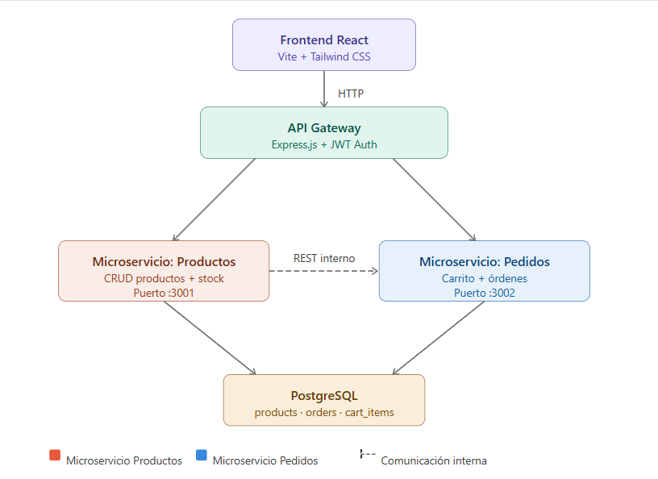

# 🛒 Shopping Cart - Arquitectura y Gestión de Base de Datos

## 📌 Descripción
Este proyecto implementa un sistema de carrito de compras siguiendo buenas prácticas de desarrollo por ambientes (**dev, qa, main**) utilizando un ORM para el mapeo de entidades y **Liquibase** para el control de versiones de la base de datos.







📄 [Ver Factura](./docs/Fact_1.pdf)

---

## 🏗️ Arquitectura del Carrito de Compras

A continuación se muestra la estructura del carrito de compras:



---

## 🗄️ Modelo de Base de Datos

La base de datos está diseñada bajo un modelo relacional que soporta el flujo completo del sistema de carrito de compras:

- Gestión de usuarios con roles
- Catálogo de productos
- Registro de clientes
- Gestión de órdenes
- Detalle de productos en el carrito

---

## 🔄 Evolución de Features por Ambiente

La evolución de un feature se maneja de forma controlada en cada ambiente para garantizar estabilidad y trazabilidad.

- **Dev (desarrollo):** cambios rápidos sobre entidades del ORM, con generación automática del esquema para agilizar desarrollo.
- **QA (testing):** se aplican migraciones controladas mediante scripts versionados, evitando cambios automáticos del ORM.
- **Main (producción):** solo se permiten cambios validados; el ORM opera en modo `validate` para garantizar consistencia sin modificar la base de datos.

Este enfoque permite control total del ciclo de vida de la base de datos en todos los ambientes.

---

## 🗄️ Gestión de Base de Datos con Liquibase

Liquibase se utiliza como herramienta de control de versiones de base de datos mediante archivos `changeLog`.

Permite:

- Versionar cambios en la base de datos
- Ejecutar migraciones de forma controlada
- Mantener trazabilidad de cambios
- Facilitar rollback en caso de errores

Al integrarlo con el ORM, se desactiva la generación automática del esquema, delegando completamente la gestión estructural a Liquibase.

---

## 🧱 Esquema de Base de Datos (SQL)

### 👤 Tabla users
```sql
CREATE TABLE IF NOT EXISTS users (
    id SERIAL PRIMARY KEY,
    email VARCHAR(100) UNIQUE NOT NULL,
    password VARCHAR(255) NOT NULL,
    role VARCHAR(20) DEFAULT 'empleado',
    name VARCHAR(100)
);